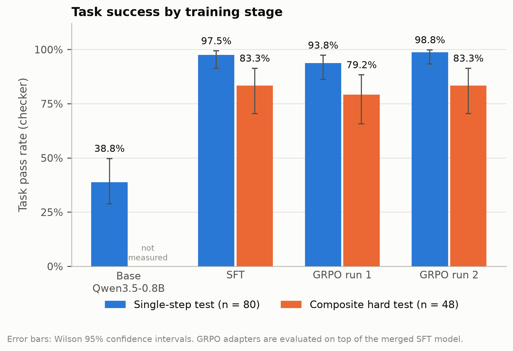
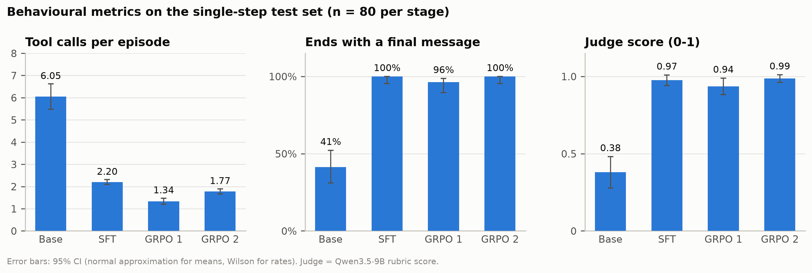
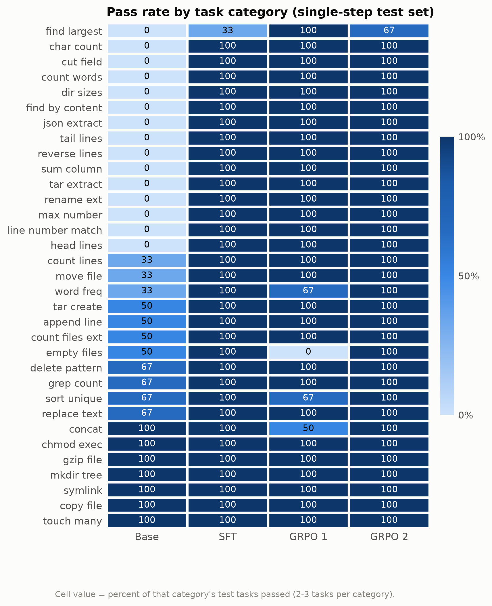
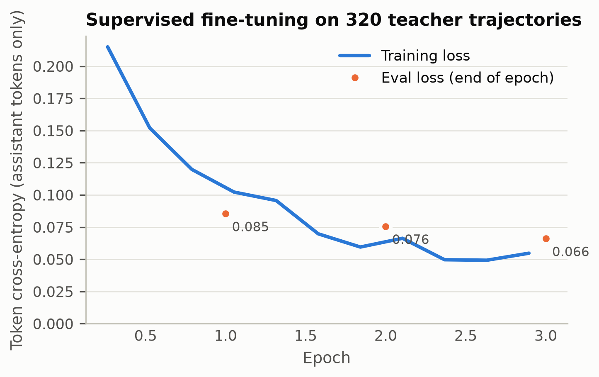
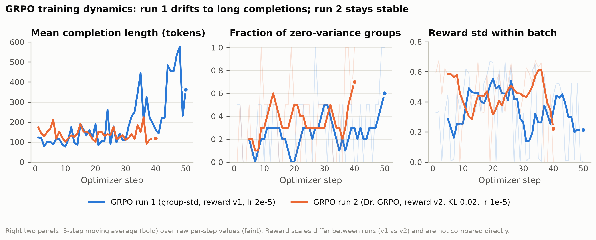

# From Imitation to Reinforcement: Training a 0.8B Terminal Agent with SFT and GRPO-RLAIF

*maruthisai25 · 18 September 2026 · single RTX 4090, one working day*

## Abstract

We study how far a 0.8-billion-parameter language model (Qwen3.5-0.8B) can be pushed as a
multi-turn terminal agent using a fully local pipeline: (i) a benchmark of 80 single-step and
48 composite shell tasks with exact bash checkers, (ii) supervised fine-tuning (SFT) on 320
trajectories distilled from a 9B teacher, and (iii) Group Relative Policy Optimization (GRPO)
with a verifiable execution reward and an AI judge (RLAIF). SFT raises the pass rate from
38.8% to 97.5% on single-step tasks and from 33.3% to 83.3% on composite tasks. A first GRPO run
regressed (93.8% / 79.2%): with the training set saturated after SFT, group-normalised
advantages amplified shaping noise and the policy drifted toward long, prose-heavy
completions. A second run with Dr. GRPO normalisation, a small KL penalty, a pass-gated
reward and a harder task mix recovered 98.8% / 83.3% while cutting tool calls per episode by
20% (single-step) and 28% (composite) and ending every episode with a proper final message.
We also document an evaluation pitfall: a GRPO LoRA trained on a merged SFT model must be
evaluated with the SFT adapter merged first, otherwise scores silently collapse to baseline.

## 1. Introduction

Small models are attractive for agentic tooling because they are cheap to run in a loop, but
out of the box they loop, refuse, or hallucinate results. The question here is practical: on
one consumer GPU, in one day, what does each stage of the standard post-training recipe
(SFT, then RL from AI feedback) actually contribute for a tool-using agent, and where does it
break? Everything below is reproducible from the repository (`README.md`).

## 2. Experimental setup

**Policy.** `Qwen/Qwen3.5-0.8B` (hybrid Gated-DeltaNet + attention, 752M text parameters),
bf16, LoRA adapters on all linear projections. Thinking mode disabled.

**Teacher and judge.** `Qwen3.5-9B` (UD-Q4_K_XL GGUF) served by `llama-server`. It (a)
produces the SFT trajectories and (b) grades transcripts 0-10 on correctness, safety,
efficiency and communication (RLAIF signal).

**Environment.** One tool, `bash(command)`, executed in a fresh per-episode sandbox
directory (10 s timeout, ulimits, denylist). The agent sees the instruction and a depth-2
listing, acts for up to 8 turns, and ends by replying without a tool call. The same
`TermEnv` class drives evaluation, SFT data generation and RL rollouts (TRL
`environment_factory`), so train and test semantics are identical.

**Tasks.** 33 programmatic templates (counting, grep, find, rename, archive, permissions,
symlinks, CSV/JSON extraction, ...) with exact checkers; 320 train / 80 test single-step
tasks. *Composite* tasks pair two templates in one instruction ("Do both of the
following...") and are filtered for solvability by the teacher: 112 train / 48 test.

**Reward.** `pass` is the checker (1/0). Run 1 used
`R = pass + 0.1·finished − 0.02·max(0, calls−1) + 0.3·judge`. Run 2 used the pass-gated
`R = pass·(1 + 0.3·judge + 0.05·finished) − 0.02·max(0, calls−4)`.

**Metrics.** Pass rate with Wilson 95% CIs, mean tool calls per episode, share of episodes
ending with a final message, and mean judge score. Evaluation samples at temperature 0.7,
batch-of-32 lockstep generation, one tool call per turn.

## 3. Method

**Stage 1, SFT.** The teacher solves the 320 training tasks; the first trajectory per task
that passes the checker, ends cleanly and uses ≤ 6 calls is kept (320/320 kept; mean 2.24
calls). TRL `SFTTrainer`, LoRA r=16, loss on assistant tokens only, 3 epochs, lr 1e-4,
effective batch 16 (6.7 min).

**Stage 2, GRPO.** TRL `GRPOTrainer` with the environment's `bash` method exposed as the
tool and `get_reward` as the reward source; tool-result tokens are masked from the loss.
8 rollouts per prompt, 16 rollouts per generation round, LoRA r=32 on the merged SFT model.

| | Run 1 | Run 2 |
|---|---|---|
| training prompts | 320 single-step | 112 composite + 64 single-step |
| steps | 50 | 40 |
| advantage normalisation | group std (`scale_rewards=group`, DAPO loss) | none (`dr_grpo`, `scale_rewards=False`) |
| KL to SFT policy (β) | 0 | 0.02 |
| learning rate | 2e-5 | 1e-5 |
| reward | v1 | v2 (pass-gated) |
| max completion | 1024 | 768 |
| wall time | 39 min | 18 min |

Exact commands (also stages 3a/3b of `scripts/run_all.sh`; the trainer's defaults equal run 1):

```
# run 1
scripts/train_grpo.py --adapter runs/sft/final --split tasks/train.jsonl --out runs/grpo \
    --steps 50 --num-gens 8 --gen-batch 16 --micro-batch 2 --judge-weight 0.3 --max-iters 6 \
    --max-completion 1024 --lr 2e-5 --beta 0 --loss-type dapo --scale-rewards group --reward-version v1
# run 2
scripts/train_grpo.py --adapter runs/sft/final --split tasks/grpo_mix.jsonl --out runs/grpo2 \
    --steps 40 --num-gens 8 --gen-batch 16 --micro-batch 2 --judge-weight 0.3 --max-iters 6 \
    --max-completion 768 --lr 1e-5 --beta 0.02 --loss-type dr_grpo --scale-rewards none --reward-version v2
```

In the language of the RL you already know: the whole trajectory is one "action", the
reward is terminal, and GRPO replaces the critic with the group mean as baseline. The
per-token PPO ratio is clipped at ε = 0.2. Dividing by the group standard deviation is what
makes credit assignment work when rewards differ within a group; it is also what goes wrong
when they do not (Section 5).

## 4. Results



*Figure 1. Pass rate by stage. SFT accounts for almost all of the gain; GRPO run 2 matches
or slightly exceeds SFT, run 1 regresses. Wilson 95% CIs.*

| Stage | Easy pass [95% CI] | Calls | Final msg | Judge | Hard pass [95% CI] | Calls | Judge |
|---|---|---|---|---|---|---|---|
| Base Qwen3.5-0.8B | 38.8% [29, 50] | 6.05 | 41% | 0.38 | 33.3% [22, 47] | 6.50 | 0.37 |
| SFT | 97.5% [91, 99] | 2.20 | 100% | 0.97 | 83.3% [70, 91] | 3.77 | 0.85 |
| GRPO run 1 | 93.8% [86, 97] | 1.34 | 96% | 0.94 | 79.2% [66, 88] | 2.71 | 0.80 |
| GRPO run 2 | **98.8%** [93, 100] | 1.77 | 100% | **0.99** | **83.3%** [70, 91] | 2.73 | 0.84 |

*Table 1. Main results. "Easy" = 80 single-step test tasks, "Hard" = 48 composite tasks.
Judge = mean Qwen3.5-9B rubric score in [0, 1]. GRPO rows use the adapter chain
SFT → GRPO.*



*Figure 2. Behavioural metrics on the single-step test set. The base model spends six calls
per episode, mostly re-running `cat answer.txt` until the turn cap, and ends with a final
message only 41% of the time. GRPO run 2 halves SFT's call budget on hard tasks
(3.77 → 2.73, median 3, max 8 → 5) without losing accuracy.*



*Figure 3. Pass rate per category. Base failures concentrate in tasks that require computing
something and then writing it (sum, max, line numbers, JSON fields). Run 1's regressions
(empty files, concat, word freq) are categories where it stopped after one command.*



*Figure 4. SFT converges within three epochs (eval loss 0.085 → 0.066, token accuracy
97.5%).*



*Figure 5. GRPO dynamics. Run 1's mean completion length grows from ~100 to ~450 tokens
after step 30 while the fraction of zero-variance groups rises; run 2 stays at 120-180
tokens with KL ≈ 0.02 throughout.*

## 5. Analysis

**SFT does the heavy lifting.** 320 short teacher trajectories were enough to move a 0.8B
model from 39% to 97.5%: the model learned the tool-call format, to write the answer rather
than state it, and to stop. This is the cheapest and most reliable stage by a wide margin.

**Why GRPO run 1 regressed.** After SFT, nearly every training prompt is solved by all
eight rollouts. With `scale_rewards=group`, the advantage is `(r − mean)/std` *within the
group*; when all eight pass, the only variation left is the −0.02 per-call penalty and the
judge's 0.1-increments, and dividing by a tiny std turns that noise into unit-scale
advantages. The policy was therefore trained hard on "fewer calls, whatever the judge
liked", not on solving tasks. Inspection of `runs/grpo/completions/*.parquet` shows the
consequences: prose before tool calls, stray `</think>` tokens, hallucinated user turns, and
episodes that *describe* the answer without writing it. Figure 5 shows the length blow-up;
at the final step all 16 rollouts had identical reward and zero advantage.

**What fixed it.** Three changes, applied together: (1) harder prompts so groups have mixed
outcomes (composite tasks, SFT pass rate 83%); (2) Dr. GRPO normalisation, which removes
the std division and the token-length bias; (3) a pass-gated reward so shaping terms can
only separate passing rollouts, plus β = 0.02 KL to the SFT policy. Run 2 improved
efficiency and communication while holding accuracy; with 80/48 test tasks the pass-rate
differences to SFT (+1 task, ±0) are within the confidence intervals, so the honest claim is
"no regression, cleaner behaviour".

**An evaluation pitfall.** The GRPO LoRA is trained on the merged SFT model. Evaluating
base + GRPO adapter alone gives 39-46%, indistinguishable from the base model, and this is
how our first GRPO numbers were produced. The evaluator now merges an adapter chain
(`runs/sft/final,runs/grpo2/final`). Any pipeline that stacks adapters should assert the
base at load time.

**Systems notes.** Per-token latency of the hybrid architecture without the `causal_conv1d`
kernel (14-47 tok/s single stream) dominates wall time, not batch width; lockstep batched
episodes cut benchmark time from >3 h to ~2 min. Over-committing the 24 GB card pages the
Vulkan judge out of VRAM and slows it 200×; stages therefore run one at a time.

## 6. Limitations

* Test sets are small (80 / 48); differences under ~8 points are not significant.
* Tasks are template-generated; the composite set is the only distribution shift tested.
* The judge and the teacher are the same model family as the policy (Qwen3.5), which
  favours format agreement; judge scores are reported but only the checker is ground truth.
* Single seed per stage; run 1 vs run 2 differ in several factors at once (an ablation would
  isolate normalisation, reward gating and task mix).
* No held-out categories: SFT saw every template family.

## 7. Reproducibility

```
FRESH=1 bash scripts/run_all.sh            # wipes derived artefacts, then runs every stage in order:
                                           #   gen_tasks (+ --hard, filter_hard) -> base benchmarks ->
                                           #   make_sft_data -> train_sft -> SFT benchmarks ->
                                           #   train_grpo run 1 + benchmarks -> run 2 + benchmarks ->
                                           #   compare.py -> make_figures.py (figures/, results_table.md)
```

Without `FRESH=1` every stage is skipped because all outputs are committed. `make_figures.py`
refuses to draw if any stage's results are missing, and writes timestamp-free PDFs so a
regeneration from unchanged results is byte-identical.

Software: torch 2.14 (cu130), transformers 5.17, TRL 1.13, PEFT 0.21, llama.cpp b9401
(Vulkan). Full per-episode transcripts for every row of Table 1 are in
`results/*.episodes.jsonl`; training logs in `logs/`.
